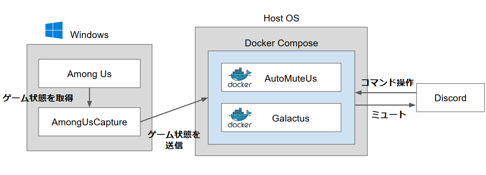
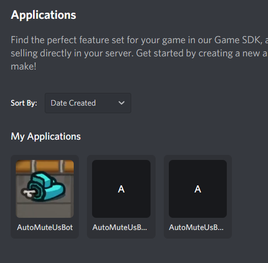
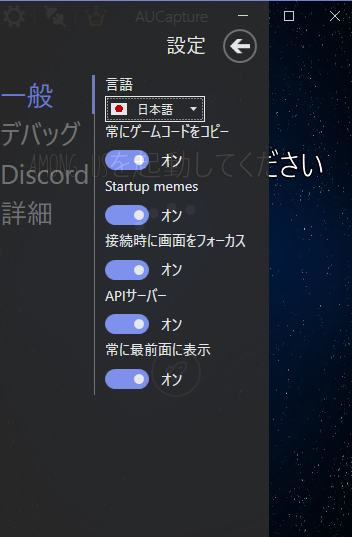
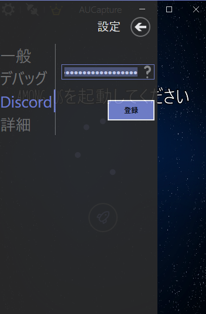
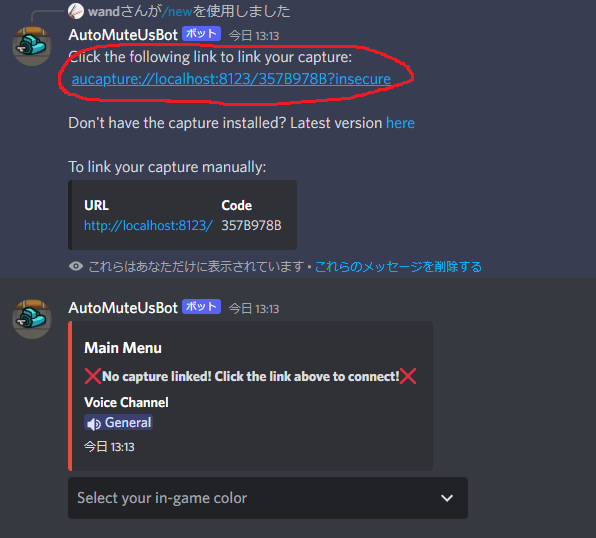
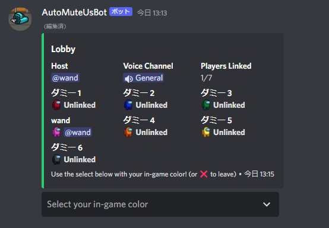
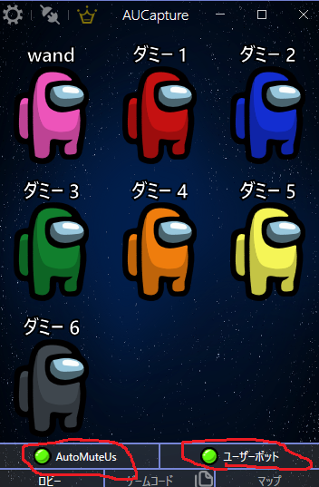

# AutoMuteUsアーキテクチャ

まず全体像と仕組みの概要を理解するのが大事



(出典: https://qiita.com/tubo28/items/0ef6d1a719faa7c26739 2022/5/7現在)

セルフホストでローカルPC上で動かす場合は Windows = Host OS です。

公式の無料/有料版を使う場合、Host OSが公式のサーバーとなります。

## 前提

AutoMuteUsを動かすには、ゲーム内に最低1人は Among Us のWindows版を動かす人が必要です。

## AmongUsCapture.exe

同じWindows上で動作しているAmong Usのメモリを監視し、ゲーム状態を取得します。

## AutoMuteUs

- AmongUsCapture.exeからゲーム状態を受信し、DiscordのWeb APIをコールして参加者をミュートします。
- Discordからのコマンドを受信し、いろいろやります。
- AutoMuteUs自体の設定や戦績をデータベースに永続化します。

DiscordのWeb APIをコールするため、Discord Botを作成し、認可トークンを発行しておく必要があります。

### Galactus

AutoMuteUsのWeb APIコール回数制限をかいくぐるためのワーカーです。

制限は認可トークンごとにかかるので、ワーカーごとに別の認可トークンを発行・設定しておく必要があります。

# 導入に必要なものの導入

## Git

https://git-scm.com/book/ja/v2/%E4%BD%BF%E3%81%84%E5%A7%8B%E3%82%81%E3%82%8B-Git%E3%81%AE%E3%82%A4%E3%83%B3%E3%82%B9%E3%83%88%E3%83%BC%E3%83%AB

---

https://github.com/automuteus/deploy

上記リンクのAutoMuteUs環境一式をダウンロードするのに使います。

Zipのダウンロードリンクもありますが、継続的なアップデート運用を考えるとGitのほうが楽だと思います。

## Docker

https://docs.docker.com/desktop/windows/install/

たぶん一番たいへん がんばって

---

https://github.com/automuteus/deploy

上記リンクのAutoMuteUs環境を動かすのに使います。

正確には、 docker-compose (Docker Compose v1) を使います。WindowsならDockerと一緒に入ってくるはず…

# 導入

## Discord Bot

https://github.com/automuteus/deploy/blob/main/BOT_README.md

---

Discord Application ≒ Bot です。
DiscordのWeb APIをコールするために、Botを作成して認可トークンを発行しておく必要があります。

Botには2種類あります:

- [first bot](https://github.com/automuteus/deploy/blob/main/BOT_README.md#for-the-first-bot)
    - AutoMuteUsサーバーで使用
    - ミュート自動化のほか、Discordコマンド (`/new`とか) への応答などにも使われます
- [extra worker bot](https://github.com/automuteus/deploy/blob/main/BOT_README.md#for-the-extra-worker-bot)
    - AmongUsCapture (AUCapture)、ならびにGalactus (AutoMuteUsのワーカー) で使用
    - ミュート自動化だけ

それぞれドキュメントで示されている適切な権限で認可トークンを発行してください。

8人で遊んだときは

- first bot 1つ
    - AutoMuteUsに設定
- extra worker bot 2つ
    - AmongUsCaptureに1つ設定
    - Galactusに1つ設定

で快適に遊べました。たぶん14人くらいまではこれでいけます。
人数がもっともっと増えたらワーカーの増設が必要かも。



## 【セルフホスト時必須】AutoMuteUs/Galactus

https://github.com/automuteus/deploy

---

どこかいい感じの場所で作業します。(例: `C:\workspace\automuteus\`)

Git for WindowsについてくるGit Bashを使うといい感じです

clone

```sh
git clone https://github.com/automuteus/deploy.git
cd deploy
```

`sample.env`を`.env`という名前でコピー

```sh
cp sample.env .env
```

.envの中身を記入します:

```diff
- AUTOMUTEUS_TAG=
- GALACTUS_TAG=
+ AUTOMUTEUS_TAG=7.2.2
+ GALACTUS_TAG=3.1.0

...

- DISCORD_BOT_TOKEN=
- GALACTUS_HOST=
+ DISCORD_BOT_TOKEN=<first botで発行した認可トークン>
+ GALACTUS_HOST=http://localhost:8123

...

- WORKER_BOT_TOKENS=
+ WORKER_BOT_TOKENS=<extra worker botで発行した認可トークンをカンマ区切りで設定>
```

- `AUTOMUTEUS_TAG`
    - AutoMuteUsのリリースバージョンを記入
    - 最新はこちら: https://github.com/automuteus/automuteus/releases
- `GALACTUS_TAG`
    - Galactusのリリースバージョンを記入
    - 最新はこちら: https://github.com/automuteus/galactus/tags
- `DISCORD_BOT_TOKEN`
    - AutoMuteUs用のfirst botトークンを記入
- `GALACTUS_HOST`
    - `http://localhost:8123` 固定値
- `WORKER_BOT_TOKENS`
    - Galactus用のextra worker botトークンをカンマ区切りで記入
    - AmongUsCapture用トークンを設定しないよう注意

サーバーを起動します:

```sh
docker-compose up -d
```

遊び終わったら止めます:

```
docker-compose down
```

## 【必須】Among Us Capture

https://github.com/automuteus/amonguscapture

---

READMEに従って導入してください。exeをダウンロードして好きなとこ(`C:\tools\`とか)に置いて実行するだけ。

ファイアウォールの警告などが出た場合は許可してあげてください。

### 設定



とりあえず全部チェックしてる



AmongUsCapture用に発行した extra worker bot の認可トークンを設定してください

# 運用

1. Windows版Among Usを起動する
2. AutoMuteUs/Galactusを起動する

```sh
docker-compose up -d
```

3. AutoMuteUs用/Galactus用に作成したDiscord Botがオンラインになっていることを確認する
4. AmongUsCapture.exeを起動する
5. AmongUsCapture用に作成したDiscord Botがオンラインになっていることを確認する
6. Among Usの部屋を立てる
7. Discordのボイスチャットに入る
8. DiscordでAutoMuteUsの`/new`コマンドを実行する
    - コマンドが出てこない場合、別チャンネルと行き来したりDiscordを再起動したりすると直るかも
9. 下記画像のリンクを踏む



10. AmongUsCaptureが連携されて準備完了





11. 遊び終わったらサーバー停止・AmongUsCaptureを終了

```sh
docker-compose down
```

## アップデート作業

### automuteus/deploy の最新化

例: `C:\workspace\automuteus\deploy` にて

```sh
git pull
```

`Already up to date.` なら何もしなくてOK

README.mdとsample.envの差分を見ながら.envを設定し直しましょう

### AutoMuteUs/Galactus 最新化

最新リリースをチェックし、.envの当該フィールドを設定し直しましょう

- `AUTOMUTEUS_TAG`
    - https://github.com/automuteus/automuteus/releases
- `GALACTUS_TAG`
    - https://github.com/automuteus/galactus/tags

### AmongUsCapture 最新化

最新のexeで置き換えましょう

https://github.com/automuteus/amonguscapture/releases

# AutoMuteUsの設定いろいろ

- ロビーからゲーム開始時のミュートでデフォルト7秒待ちます。  
  「うわーインポスターだ〜〜」とか喋って聞かれてしまう事故防止のためちょっと早めるとよいです:

```
/settings delays start-phase:LOBBY end-phase:TASKS delay:4 
```

- デフォルトで死者は死亡後の会議開けから霊界チャットに参加できますが、下記設定で死んだ瞬間に霊界チャットに入れるようになります:

```
/settings unmute-dead unmute:true
```

# misc

- だれか落ちてしまった場合、ミュートが解除されません。Discord管理者が解除してあげましょう


  
